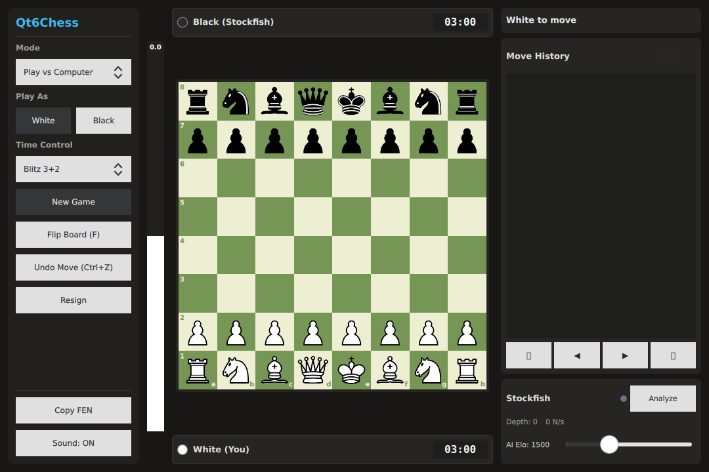

# ♟️ Qt6Chess

[](https://github.com/AhooraZen/Qt6Chess/releases)
[](https://github.com/AhooraZen/Qt6Chess/actions)
[](https://github.com/AhooraZen/Qt6Chess/releases)
[](LICENSE)
[](https://en.cppreference.com/w/cpp/20)
[](https://www.qt.io/)

A fast, lightweight, native desktop chess app and interactive ANSI terminal client for Linux. Built with **C++20**, **Qt 6.8 (QML SceneGraph)**, and **Stockfish 17.1**.

Zero Electron bloat, starts in 50 milliseconds, and eats around 30MB of RAM.

---



---

## Why?

Most desktop chess apps today are either heavy Electron wrappers that eat half a gigabyte of memory just to show an 8x8 grid, or dated X11 interfaces that haven't been touched in a decade.

Qt6Chess was built as a clean, offline-first chess tool:
- You get a slick hardware-accelerated GUI when you want it.
- You get a full ANSI terminal TUI with mouse support when you want to look productive in a terminal window.
- Fully offline engine analysis with Stockfish 17 — no account required, no tracking, no subscriptions.

---

## Features

### 🖥️ Native Hardware-Accelerated GUI
- **SceneGraph Rendering**: Butter-smooth 60/120 FPS piece animations and clean vector SVG graphics.
- **Board Themes**: 4 visual presets — Emerald, Wood, Slate, and Midnight.
- **Evaluation Bar**: Real-time centipawn and mate evaluations normalized to White.
- **MultiPV Candidate Lines**: Live display of top 3 candidate engine variations with evaluation badges.
- **Tactical Arrows**: Engine best-move hints drawn directly over the board.
- **PGN & FEN Ingestion**: Paste or copy FEN positions and full PGN games with a single click.

### 📟 ANSI SGR Terminal Mode (`qt6chess --cli`)
- Full interactive chess in your terminal.
- **Mouse support**: Click on squares directly in your terminal to select and move pieces.
- Keyboard navigation (WASD/Arrows + Enter) and SAN/UCI move entry (`e4`, `Nf3`).
- TrueColor piece badges, captured pieces tracker, and live Stockfish evaluation hints.

### ⏱️ Time Controls & Game Modes
- **Game Modes**: Play vs Computer (Elo configurable from 800 to 3000+), Local Pass & Play, and Free Analysis Board.
- **Clocks**: Blitz (3+2), Rapid (10+0), Bullet (1+1), Classical (15+10), or Unlimited.
- **Move History**: Full turn-by-turn list with branching support and navigation rewind.

---

## Installation

### Arch Linux (Binary Package)
Pre-built packages are compiled natively inside official Arch Linux containers on every release:

```bash
# Download and install the latest Arch package directly
sudo pacman -U https://github.com/AhooraZen/Qt6Chess/releases/download/v1.0.3/qt6chess-1.0.3-1-x86_64.pkg.tar.zst
```

### Build from Source
Requires GCC/Clang with C++20 support, CMake 3.25+, Ninja, and Qt 6.8 (Core, Gui, Quick, QuickControls2, Svg, Multimedia).

```bash
# Clone the repository
git clone https://github.com/AhooraZen/Qt6Chess.git
cd Qt6Chess

# Configure and build
cmake -B build -G Ninja -DCMAKE_BUILD_TYPE=Release
ninja -C build

# Run unit tests
ctest --test-dir build --output-on-failure

# Launch the app
./build/bin/Qt6Chess
```

*(Optional) Install Stockfish for engine play and analysis:*
```bash
# Arch Linux
sudo pacman -S stockfish

# Debian / Ubuntu
sudo apt install stockfish
```

---

## Terminal TUI Mode

Launch with the `--cli` flag:

```bash
qt6chess --cli
```

### Controls in TUI
| Key / Input | Action |
|-------------|--------|
| **Mouse Click** | Click piece, then click destination to move |
| **Arrows / WASD** | Move board cursor |
| **Enter / Space** | Select piece / Confirm destination |
| **`e`** | Request Stockfish evaluation |
| **`u`** | Undo last move |
| **`f`** | Flip board orientation |
| **`/`** | Type UCI or SAN move (e.g. `e4`, `Nf3`, `e2e4`) |
| **`?`** | Toggle in-game help menu |
| **`q`** | Quit cleanly |

---

## Tech Stack & Architecture

- **Core**: C++20, Bitboard move generator (`chess.hpp`) capable of generating ~50M legal moves/sec.
- **Frontend**: Qt Quick 6.8 (QML SceneGraph) with custom `QAbstractListModel` implementations.
- **Engine IPC**: Non-blocking asynchronous UCI communication over `QProcess` with signal throttling.
- **TUI**: Raw POSIX `termios` handler with ANSI SGR sequences and 1006 SGR mouse tracking.
- **CI/CD**: GitHub Actions building native Arch Linux `.pkg.tar.zst` packages in Docker.

---

## Support & Coffee

If this little project saved you some RAM or you had fun playing chess in your terminal, feel free to give it a ⭐ or buy me a coffee:

[](https://buymeacoffee.com/ahoora)
[](https://ko-fi.com/ahoora)

---

## License

Released under the [MIT License](LICENSE). Copyright (c) 2026 AhooraZen.
